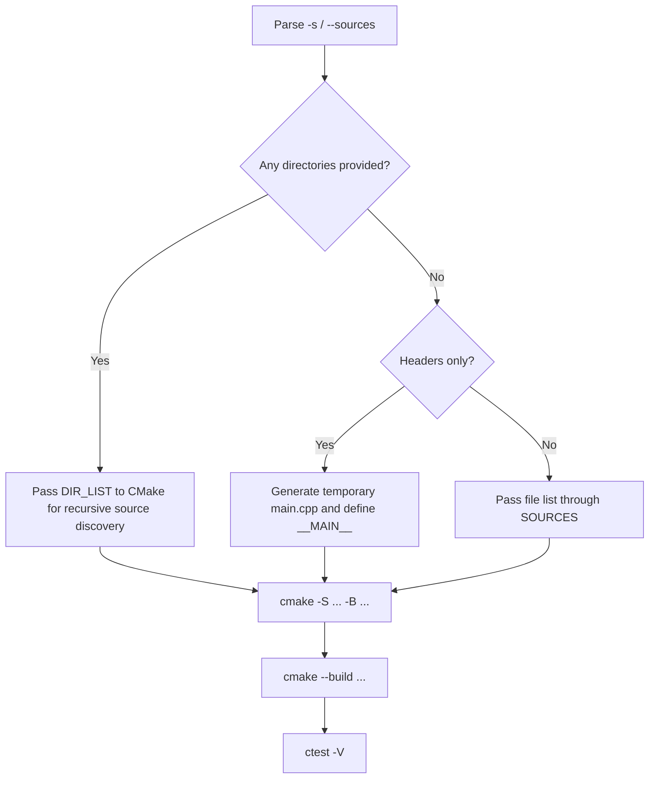

# cpprun

[中文](README.md)

[](https://github.com/kangwenjun/cpprun/actions/workflows/ci.yml)
[](LICENSE)


cpprun is a lightweight helper for small C/C++ samples and quick smoke tests: give it a list of source files or a directory, and it will drive CMake to configure, build, and run CTest.

This repository also includes minimal examples that demonstrate three common cases:

- a single source file
- a directory containing multiple source files
- a header-driven sample that can provide an entry point

It is intentionally optimized for quick validation and lightweight automation, not for full-scale C++ project scaffolding.

## Good Fit For

- practice repos, teaching material, and small sample projects
- quickly checking whether a set of `.cpp` files can build and run together
- adding a minimal smoke-test loop without adopting a full test framework first
- wiring simple C++ examples into GitHub Actions with very little setup

## Highlights

- wraps `cmake configure`, `cmake --build`, and `ctest -V` behind one command
- supports file-list mode, directory mode, and header mode
- can repeat the same smoke test with `--repeat`
- works more predictably in local and CI environments with `--clean` and explicit `-b`
- ships with runnable examples, and the documented commands are aligned with CI

## Requirements

- Python 3.8+
- CMake 3.15+
- A compiler with C++20 support

CTest ships with CMake, so no separate installation is required.

## Quick Start

Use `/` as the path separator in commands when possible. The examples below work well across Windows, Linux, and GitHub Actions.

```powershell
# Single source file
python cpprun.py -b build/hello -s "tests/main.cpp"

# Directory mode: recursively collect C/C++ source files under the directory
python cpprun.py -b build/calc -s "tests/calc"

# Header mode: cpprun generates a temporary main.cpp in the build directory
python cpprun.py -b build/timestamp -s "tests/timestamp/current_time.hpp"
```

For each run, the script performs these steps:

1. `cmake -S ... -B ...`
2. `cmake --build ...`
3. `ctest -V`

The generated executable target is named `project_bin`, and the default registered CTest case is `run_project`.

## Execution Flow

The diagram below summarizes what cpprun does during a typical invocation:



## Common Options

- `-s` / `--sources`: a list of source files or directories, separated by `;`
- `-b` / `--build-dir`: the build directory. Passing this explicitly is recommended, especially in CI or Linux environments
- `-r` / `--repeat`: repeat `ctest` multiple times
- `-t` / `--timeout`: set the CTest timeout in seconds
- `--clean`: remove the existing build directory before configuring
- `-g` / `--generator`: explicitly select a CMake generator
- `-n` / `--target-name`: optional, passed to CMake as `TARGET_NAME` to control the generated executable name (default: `project_bin`)
- `--no-configure`, `--no-build`, `--no-test`: skip one stage for debugging

Examples:

```powershell
# Multiple files
python cpprun.py -b build/multi -s "tests/calc/main.cpp;tests/calc/test_add.cpp;tests/calc/test_sub.cpp"

# Run the same test 3 times
python cpprun.py -b build/repeat -s "tests/main.cpp" --repeat 3
```

## Example Output

Here is a shortened terminal transcript that highlights the main stages printed by the script. Exact paths, compiler lines, and CMake details will vary by platform.

```text
> python cpprun.py -b build/calc -s "tests/calc"

运行命令: cmake -S <repo> -B <repo>/build/calc -DCMAKE_BUILD_TYPE=Release -DDIR_LIST=<repo>/tests/calc
运行命令: cmake --build <repo>/build/calc --config Release
运行命令: ctest -V

...
1: Test command: ...
1: Working Directory: build/calc
1: Test timeout computed to be: 10000000
1: Running tests...
1: Test Add: 2 + 3 = 5
1: Test Sub: 5 - 2 = 3
1: Tests completed.
1/1 Test #1: run_project ......................   Passed    0.02 sec

100% tests passed, 0 tests failed out of 1

Total Test time (real) =   0.02 sec
```

## Header Mode

When `-s` contains only header files, cpprun generates a temporary `main.cpp` in the build directory, defines `__MAIN__`, and then includes those headers.

So header mode does not mean that any arbitrary header can be executed directly. The header must be able to provide a compilable entry point when `__MAIN__` is defined. See [tests/timestamp/current_time.hpp](tests/timestamp/current_time.hpp) for the intended pattern.

## Current Scope

- the current CMake setup builds a single executable target named `project_bin`
- the test flow is oriented toward executable smoke tests rather than a full assertion framework
- directory mode relies on recursive CMake source collection and is not aimed at complex multi-target projects
- header mode depends on the `__MAIN__` convention and is not suitable for arbitrary library headers

## Repository Layout

- [cpprun.py](cpprun.py): CLI entry point that configures, builds, and runs CTest
- [CMakeLists.txt](CMakeLists.txt): generic CMake project that builds `project_bin` from `SOURCES` or `DIR_LIST`
- [tests/](tests): minimal samples and smoke-test inputs
- [.github/workflows/ci.yml](.github/workflows/ci.yml): GitHub Actions workflow
- [docs/project-layout.en.md](docs/project-layout.en.md): detailed structure and responsibility notes

## Continuous Integration

The repository includes a basic GitHub Actions workflow that validates the main usage patterns on both Windows and Linux:

- single-file mode
- directory mode
- header mode

This keeps the examples shown in the README aligned with the actual automation.

## Common Failure Cases

- “CMake not found”: `cmake` is not available in PATH, or the current shell does not have the expected toolchain environment loaded.
- “Not found source files”: usually means `-s` was omitted, or one of the provided paths does not exist.
- directory mode produces no buildable target: the directory contains only headers. The current directory mode only collects source files such as `.c`, `.cc`, `.cpp`, and `.cxx`.
- header mode fails to compile: the header does not provide a complete compilable entry point when `__MAIN__` is defined, or the header has broken include paths.
- CTest fails after a successful build: this is usually a runtime failure in the produced executable rather than a CMake configuration problem.

## FAQ

**Why is passing `-b` recommended?**

An explicit build directory makes local and CI behavior more predictable, and logs are easier to inspect. When `-b` is omitted, the script now creates a timestamped build directory under the script directory (for example `build/20260331T120001`), which keeps behavior more consistent across Windows, Linux, and macOS; however, for CI or reproducible builds you should still pass `-b` explicitly.

**Does directory mode compile `.hpp` or `.h` files automatically?**

No. Directory mode only collects C/C++ source files. Headers are expected to be used through includes, not as standalone compilation units.

**Can I pass multiple files or directories at once?**

Yes. Separate entries with `;`, for example `-s "tests/main.cpp;tests/calc"`.

**Can this replace GoogleTest, Catch2, or another test framework?**

No. cpprun is better understood as a minimal build-and-smoke-test wrapper. It is useful for quick validation, but it is not a replacement for a full assertion-based test framework.

## Roadmap

- add more examples, including failure cases and samples with stronger assertions
- evaluate whether CMake Presets or another machine-readable config layer should be added

## License

This project is released under the MIT License. See [LICENSE](LICENSE).