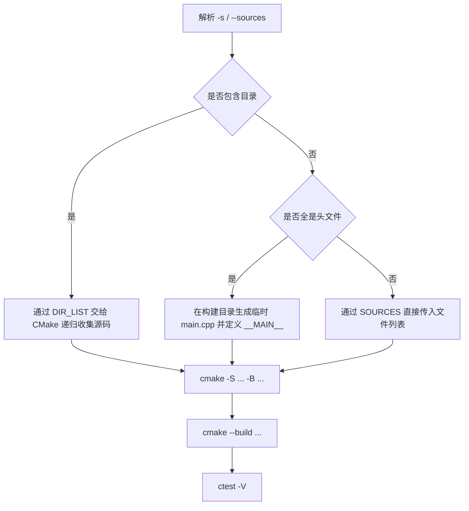

# cpprun

[English](./docs/en/README.md)

[](https://github.com/kangwenjun/cpprun/actions/workflows/ci.yml)
[](LICENSE)


cpprun 是一个轻量的 C/C++ 运行辅助脚本：给它一组源文件，或者一个包含示例代码的目录，它会调用 CMake 完成配置、构建并运行 CTest。

这个仓库同时包含了最小示例，用来演示三种常见场景：

- 单个源文件
- 多个源文件组成的目录
- 通过头文件生成可执行入口的头文件示例

它更适合“快速验证”和“轻量自动化”，而不是完整的大型 C++ 工程脚手架。

## 适用场景

- 练习题、示例仓库、教学代码的快速构建与运行
- 想用一条命令验证多个 `.cpp` 文件是否能一起编译并执行
- 需要一个最小化的 smoke test 流程，而不想先搭完整测试框架
- 想把简单示例仓库接到 GitHub Actions 上持续验证

## 主要特性

- 统一封装 `cmake configure`、`cmake --build` 和 `ctest -V`
- 同时支持文件列表模式、目录模式和头文件模式
- 可以通过 `--repeat` 快速做重复 smoke test
- 可以通过 `--clean` 和显式 `-b` 让本地与 CI 行为更可控
- 仓库自带可运行示例，文档命令与 CI 用例保持一致

## 依赖

- Python 3.8+
- CMake 3.15+
- 支持 C++20 的编译器

说明：CTest 随 CMake 一起提供，不需要单独安装。

## 快速开始

建议在命令行中统一使用 `/` 作为路径分隔符，这样 Windows、Linux 和 GitHub Actions 的示例都保持一致。

```powershell
# 单个源文件
python cpprun.py -b build/hello -s "tests/main.cpp"

# 目录模式：自动收集目录内的 C/C++ 源文件
python cpprun.py -b build/calc -s "tests/calc"

# 头文件模式：脚本会在构建目录中生成临时 main.cpp
python cpprun.py -b build/timestamp -s "tests/timestamp/current_time.hpp"
```

运行完成后，脚本会依次执行：

1. `cmake -S ... -B ...`
2. `cmake --build ...`
3. `ctest -V`

默认生成的可执行目标名是 `project_bin`，默认注册的测试名是 `run_project`。

## 执行流程

下面这张流程图概括了 cpprun 在一次命令执行中会做的事情：



## 常用参数

- `-m` / `--cmake-dir`：包含 `CMakeLists.txt` 的目录（默认：脚本所在目录）
- `-b` / `--build-dir`：构建输出目录（绝对或相对路径）。推荐始终显式传入，尤其是在 CI 环境中
- `-n` / `--target-name`：构建目标名（传递给 CMake 的 `TARGET_NAME` 变量，默认: `project_bin`）
- `-c` / `--config`：构建配置（多配置生成器使用，例如 `Release` / `Debug`，默认 `Release`）
- `-j` / `--jobs`：并行构建作业数（传递给 `cmake --build --parallel`）
- `-s` / `--sources`：以分号分隔的源文件/头文件或目录列表，例如: `tests/main.cpp;tests/utils`
- `-r` / `--repeat`：运行 `ctest` 的次数，默认为 1
- `-t` / `--timeout`：测试超时时间（秒）；`0` 表示不设置超时
- `-g` / `--generator`：CMake 生成器名称（例如 `Ninja` 或 `Visual Studio`）
- `-i` / `--install-dir`：安装目录（传递给 `cmake --install --prefix`）
- `--clean`：在配置前删除构建目录
- `--no-configure`：跳过 cmake 配置步骤
- `--no-build`：跳过构建步骤（仅运行 ctest）
- `--no-install`：即使指定了 `--install-dir` 也跳过安装步骤
- `--no-test`：跳过运行 ctest 测试

示例：

```powershell
# 指定 CMake 源目录与构建目录
python cpprun.py -m . -b build/calc -s "tests/calc"

# 指定并行作业并重复运行测试
python cpprun.py -b build/repeat -s "tests/main.cpp" -j 4 --repeat 3

# 指定安装目录（可与 --no-install 组合以跳过安装）
python cpprun.py -b build/install -s "tests/timestamp/current_time.hpp" -i D:/output
```

## 运行输出示例

下面是一个经过截断的终端输出示例，用来说明脚本实际会打印哪些关键阶段。具体路径、编译器信息和 CMake 细节会因平台而异。

```text
> python cpprun.py -b build/calc -s "tests/calc"

运行命令: cmake -S <repo> -B <repo>/build/calc -DCMAKE_BUILD_TYPE=Release -DDIR_LIST=<repo>/tests/calc
运行命令: cmake --build <repo>/build/calc --config Release
运行命令: ctest -V

...
1: Test command: ...
1: Working Directory: build/calc
1: Test timeout computed to be: 10000000
1: Running tests...
1: Test Add: 2 + 3 = 5
1: Test Sub: 5 - 2 = 3
1: Tests completed.
1/1 Test #1: run_project ......................   Passed    0.02 sec

100% tests passed, 0 tests failed out of 1

Total Test time (real) =   0.02 sec
```

## 头文件模式说明

当 `-s` 只传入头文件时，cpprun 会在构建目录中生成一个临时 `main.cpp`，其中会先定义 `__MAIN__`，然后再 `#include` 这些头文件。

这意味着头文件模式不是“任意头文件都能直接运行”，而是要求头文件在 `__MAIN__` 被定义时，能够提供一个可编译的程序入口。这个约定可以参考 [tests/timestamp/current_time.hpp](tests/timestamp/current_time.hpp)。

## 当前边界

- 当前 CMake 配置默认只生成一个可执行目标 `project_bin`
- 这里的测试更偏向可执行 smoke test，而不是成熟断言框架
- 目录模式依赖 CMake 递归收集源码，不适合复杂多目标工程
- 头文件模式依赖 `__MAIN__` 约定，不适用于普通库头文件

## 仓库结构

- [CHANGELOG.md](CHANGELOG.md)：发行说明与重要变更记录
- [RELEASE_NOTES.md](RELEASE_NOTES.md)：发布备注（短期发布信息）
- [RULES.md](RULES.md)：贡献/代码风格和仓库约定
- [cpprun.py](cpprun.py)：命令行入口，负责解析参数、调用 CMake/CTest
- [CMakeLists.txt](CMakeLists.txt)：项目级 CMake 配置，使用 `SOURCES` / `DIR_LIST` 生成示例可执行目标
- [src/](src)：库/工具的源代码（包含若干头文件辅助功能）
- [tests/](tests)：最小示例与 smoke test 用例（示例命令使用这些文件）
- [docs/](docs)：文档目录（含 `docs/en/README.md` 与 `project-layout.md`）
- [build/](build)：示例/历史构建输出（通常由脚本生成，可被忽略或清理）
- [.github/workflows/ci.yml](.github/workflows/ci.yml)：GitHub Actions CI 配置，验证单文件/目录/头文件用例
- [LICENSE](LICENSE)：MIT 许可证

说明：仓库以单文件/目录/头文件三种主要用法为中心，`tests/` 下包含可直接运行的示例，`src/` 存放脚本的辅助实现；`build/` 目录为构建产物示例，不需检查入版本控制。

## 持续集成

仓库内置了一个基础 GitHub Actions 工作流，会在 Windows 和 Linux 上分别验证：

- 单文件模式
- 目录模式
- 头文件模式

这样可以保证 README 中展示的主要用法始终可运行。

## 常见失败原因

- 提示“未找到 CMake”：说明 `cmake` 不在 PATH 中，或者当前终端环境没有加载正确的开发工具链。
- 提示“Not found source files”：通常是没有传 `-s`，或者传入的路径不存在。
- 目录模式构建不出任何目标：因为目录里只有头文件。当前目录模式只递归收集 `.c`、`.cc`、`.cpp`、`.cxx` 等源码文件。
- 头文件模式编译失败：说明该头文件在定义 `__MAIN__` 时并不能提供一个完整可编译的入口，或者头文件里的 include 路径本身有问题。
- CTest 失败但编译成功：这通常不是 CMake 配置问题，而是程序运行时返回了非零退出码。

## FAQ

**为什么推荐始终传 `-b`？**

显式指定构建目录后，本地和 CI 的行为更稳定，日志也更好定位。当前脚本在未传 `-b` 时会在脚本目录下生成 `build/<timestamp>`（例如 `build/20260331T120001`），这样在 Windows、Linux 和 macOS 上行为更一致；尽管如此，在 CI 或可重复构建场景仍建议显式传入 `-b`。

**目录模式会自动把 `.hpp` 或 `.h` 当成编译单元吗？**

不会。目录模式只收集 C/C++ 源文件；头文件会作为 include 被使用，而不是作为单独的编译单元。

**可以同时传多个文件或多个目录吗？**

可以。使用 `;` 分隔多个条目即可，例如 `-s "tests/main.cpp;tests/calc"`。

**它能替代 GoogleTest、Catch2 这类测试框架吗？**

不能。cpprun 更像一个最小化的构建和 smoke test 包装器，适合快速验证，不适合替代成熟断言框架。

## 路线图

- 增加更多示例，包括失败用例和更接近真实断言的测试样例
- 评估是否补充 CMake Presets 或更清晰的机器可读配置

## License

本项目使用 MIT License，见 [LICENSE](LICENSE)。


